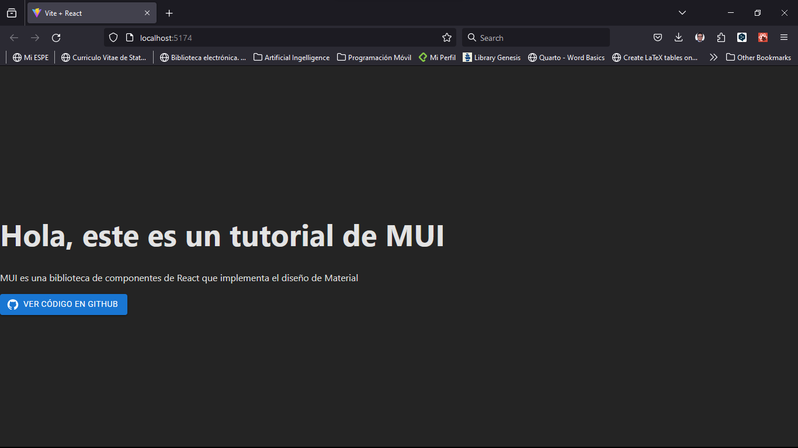

# Tutorial de instalación de MUI

MUI es una biblioteca de componentes de React que implementa el diseño de Material, un sistema de diseño creado por Google que se basa en principios de usabilidad, accesibilidad y adaptabilidad. Con MUI, puedes crear interfaces de usuario modernas y consistentes con facilidad, utilizando componentes predefinidos y personalizables que siguen las especificaciones de Material.

En este tutorial, te voy a enseñar cómo instalar MUI en un proyecto de React creado con Vite, una herramienta que te permite crear aplicaciones web rápidas y ligeras. Vite utiliza el formato de módulos ES nativos del navegador, lo que elimina la necesidad de un paso de empaquetado durante el desarrollo. Esto hace que el desarrollo sea más rápido y eficiente.

## Requisitos previos

Para seguir este tutorial, necesitas tener instalado lo siguiente en tu sistema:

**Node.js**, un entorno de ejecución de JavaScript que te permite ejecutar código JavaScript fuera del navegador. Puedes descargarlo desde aquí.

**npm**, un gestor de paquetes de Node.js que te permite instalar y administrar las dependencias de tu proyecto. 

Se instala junto con Node.js, pero puedes actualizarlo siguiendo estas instrucciones.

Un editor de código de tu preferencia, como Visual Studio Code, que puedes descargar desde aquí.

## Crear un proyecto de React con Vite

El primer paso es crear un proyecto de React con Vite. Para ello, abre una terminal y ejecuta el siguiente comando:

```bash	
npm init vite@latest .
```

```bash
npm install
```
Para iniciar el servidor de desarrollo, ejecuta el siguiente comando:

```bash
npm run dev
```
Esto abrirá una pestaña en tu navegador con la dirección [http://localhost:5174/](http://localhost:5174/), donde podrás ver la aplicación de React en funcionamiento. Deberías ver algo así:


## Instalar MUI

El siguiente paso es instalar MUI en el proyecto. Para ello, abre otra terminal y ejecuta el siguiente comando:

```bash	
npm install @mui/material @emotion/react @emotion/styled
```
Esto instalará el paquete principal de MUI, que contiene los componentes de React, y las dependencias de Emotion, que son necesarias para el motor de estilos de MUI. Emotion es una biblioteca de estilos CSS-in-JS que te permite escribir estilos con JavaScript y aplicarlos a los componentes de React.

También vamos a instalar el paquete de fuentes de Roboto, que es la fuente por defecto de MUI, y el paquete de iconos de Material, que contiene los iconos oficiales de Material. Para ello, ejecuta el siguiente comando:

```bash
npm install @fontsource/roboto @mui/icons-material
```

Finalmente, vamos a instalar el paquete de MUI Lab, que contiene componentes experimentales que aún no están listos para ser incluidos en el paquete principal de MUI, pero que pueden ser útiles para algunos casos de uso. Por ejemplo, el componente LoadingButton, que muestra un indicador de carga al hacer clic en el botón. Para instalar el paquete de MUI Lab, ejecuta el siguiente comando:

``` bash
npm install @mui/lab
```
## Utilizar un componente de MUI

Ahora que tenemos instalado MUI, vamos a utilizar uno de sus componentes en nuestra aplicación. Para ello, vamos a editar el archivo src/App.jsx, que es el componente principal de la aplicación. Puedes abrirlo con tu editor de código favorito.

En este archivo, vamos a importar el componente Button de MUI, que nos permite crear botones con diferentes variantes y colores. También vamos a importar la fuente de Roboto y el icono de GitHub. El código quedaría así:

```jsx
import { Button } from "@mui/material";
import GitHubIcon from "@mui/icons-material/GitHub";
import "@fontsource/roboto";

function App() {
  return (
    <div className="App">
      <h1>Hola, este es un tutorial de MUI</h1>
      <p>MUI es una biblioteca de componentes de React que implementa el diseño de Material</p>
      <Button variant="contained" color="primary" startIcon={<GitHubIcon />}>
        Ver código en GitHub
      </Button>
    </div>
  );
}

export default App;
```
Guarda el archivo y vuelve al navegador. Deberías ver algo así:



¡Felicidades! Has creado tu primer componente de MUI.

Puedes ver la documentación de MUI para explorar más componentes y opciones de personalización. Espero que este tutorial te haya sido útil y que disfrutes creando interfaces de usuario con MUI. 😊