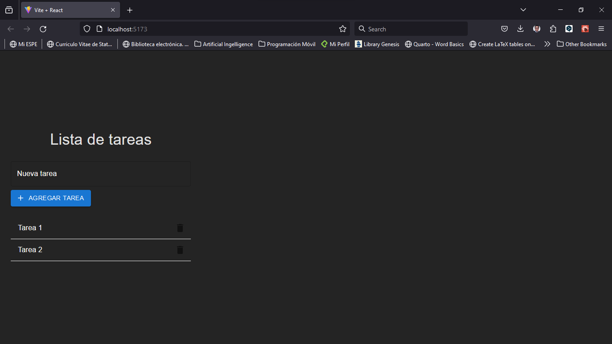

# Lista de tareas con Vite + React + MUI



Para crear una lista de tareas con Vite, React y MUI, sigue estos pasos:

``` bash
npm init vite@latest .
```

Esto creará un nuevo proyecto de Vite en el directorio actual, con las opciones por defecto. A continuación, se te pedirá que elijas un entorno de desarrollo. Puedes elegir entre las siguientes opciones:

``` bash
npm install
```
Para iniciar el servidor de desarrollo, ejecuta el siguiente comando:

``` bash
npm run dev
```
Esto abrirá una pestaña en tu navegador con la dirección http://localhost:3000/, donde podrás ver la aplicación de React en funcionamiento.

Ahora que tenemos el proyecto de React listo, vamos a instalar MUI y sus dependencias. Para ello, abre otra terminal y ejecuta el siguiente comando:

``` bash
npm install @mui/material @emotion/react @emotion/styled
```
Esto instalará el paquete principal de MUI, que contiene los componentes de React, y las dependencias de Emotion, que son necesarias para el motor de estilos de MUI. Emotion es una biblioteca de estilos CSS-in-JS que te permite escribir estilos con JavaScript y aplicarlos a los componentes de React.

También vamos a instalar el paquete de fuentes de Roboto, que es la fuente por defecto de MUI, y el paquete de iconos de Material, que contiene los iconos oficiales de Material. Para ello, ejecuta el siguiente comando:

``` bash
npm install @fontsource/roboto @mui/icons-material
```
Finalmente, vamos a instalar el paquete de MUI Lab, que contiene componentes experimentales que aún no están listos para ser incluidos en el paquete principal de MUI, pero que pueden ser útiles para algunos casos de uso. Por ejemplo, el componente LoadingButton, que muestra un indicador de carga al hacer clic en el botón. Para instalar el paquete de MUI Lab, ejecuta el siguiente comando:

``` bash
npm install @mui/lab
```
Con esto, hemos instalado MUI y sus dependencias en nuestro proyecto de React. Ya estamos listos para usar los componentes de MUI en nuestra aplicación.

## Crear la lista de tareas con MUI

Ahora que tenemos MUI instalado en nuestro proyecto de React, vamos a crear la lista de tareas con los componentes de MUI. Para ello, abre el archivo App.js y reemplaza su contenido por el siguiente código:

``` jsx
import { useState } from "react";
import {
  Container,
  Typography,
  TextField,
  Button,
  List,
  ListItem,
  ListItemText,
  ListItemSecondaryAction,
  IconButton,
} from "@mui/material";
import { Add as AddIcon, Delete as DeleteIcon } from "@mui/icons-material";
import { styled } from "@mui/system";

const StyledList = styled(List)({
  marginTop: 16,
});

const StyledListItem = styled(ListItem)({
  borderBottom: "1px solid #f0f0f0",
});

const StyledListItemText = styled(ListItemText)({
  color: "white", // Change the text color to white
});

function App() {
  const [tasks, setTasks] = useState(["Tarea 1", "Tarea 2"]);
  const [newTask, setNewTask] = useState("");

  const handleAddTask = () => {
    if (newTask) {
      setTasks([...tasks, newTask]);
      setNewTask("");
    }
  };

  const handleDeleteTask = (index) => {
    setTasks(tasks.filter((_, i) => i !== index));
  };

  return (
    <Container maxWidth="sm">
      <Typography variant="h4" align="center" gutterBottom>
        Lista de tareas
      </Typography>
      <form
        onSubmit={(e) => {
          e.preventDefault();
          handleAddTask();
        }}
      >
        <TextField
          label="Nueva tarea"
          variant="outlined"
          fullWidth
          margin="normal"
          value={newTask}
          onChange={(e) => setNewTask(e.target.value)}
          InputLabelProps={{
            style: { color: "white" } // Change the text color of the label to white
          }}
          InputProps={{
            style: { color: "white" } // Change the text color of the input to white
          }}
        />
        <Button
          type="submit"
          variant="contained"
          color="primary"
          startIcon={<AddIcon />}
        >
          Agregar tarea
        </Button>
      </form>
      <StyledList>
        {tasks.map((task, index) => (
          <StyledListItem key={index}>
            <StyledListItemText primary={task} />
            <ListItemSecondaryAction>
              <IconButton
                edge="end"
                aria-label="delete"
                onClick={() => handleDeleteTask(index)}
              >
                <DeleteIcon />
              </IconButton>
            </ListItemSecondaryAction>
          </StyledListItem>
        ))}
      </StyledList>
    </Container>
  );
}

export default App;
```

## Ejecutar la aplicación

Para ver tu lista de tareas en acción, ejecuta el siguiente comando en tu terminal:

``` bash
npm run dev
```

Esto iniciará tu aplicación React y la abrirá automáticamente en tu navegador predeterminado en la dirección [http://localhost:5173/](http://localhost:5173/).