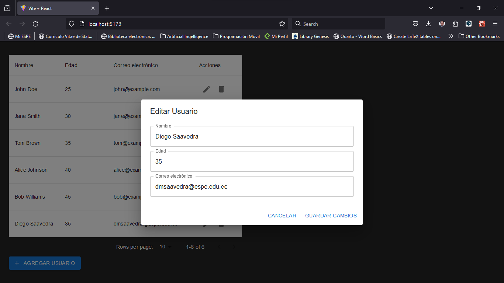

# Tabla de datos con MUI



Para crear una tabla de datos con MUI, sigue estos pasos:

```bash
npm init vite@latest .
```
Esto creará un nuevo proyecto de Vite en el directorio actual, con las opciones por defecto. A continuación, se te pedirá que elijas un entorno de desarrollo. Puedes elegir entre las siguientes opciones:

```bash
npm install
```
Para iniciar el servidor de desarrollo, ejecuta el siguiente comando:

```bash
npm run dev
```
Esto abrirá una pestaña en tu navegador con la dirección [localhost:5173](localhost:5173), donde podrás ver la aplicación de React en funcionamiento.

Ahora que tenemos el proyecto de React listo, vamos a instalar MUI y sus dependencias. Para ello, abre otra terminal y ejecuta el siguiente comando:

```bash
npm install @mui/material @emotion/react @emotion/styled
```
Esto instalará el paquete principal de MUI, que contiene los componentes de React, y las dependencias de Emotion, que son necesarias para el motor de estilos de MUI. Emotion es una biblioteca de estilos CSS-in-JS que te permite escribir estilos con JavaScript y aplicarlos a los componentes de React.

También vamos a instalar el paquete de fuentes de Roboto, que es la fuente por defecto de MUI, y el paquete de iconos de Material, que contiene los iconos oficiales de Material. Para ello, ejecuta el siguiente comando:

```bash
npm install @fontsource/roboto @mui/icons-material
```
Finalmente, vamos a instalar el paquete de MUI Lab, que contiene componentes experimentales que aún no están listos para ser incluidos en el paquete principal de MUI, pero que pueden ser útiles para algunos casos de uso. Por ejemplo, el componente LoadingButton, que muestra un indicador de carga al hacer clic en el botón. Para instalar el paquete de MUI Lab, ejecuta el siguiente comando:

```bash
npm install @mui/lab
```
Con esto, hemos instalado MUI y sus dependencias en nuestro proyecto de React. Ya estamos listos para usar los componentes de MUI en nuestra aplicación.
Crear la tabla de datos con MUI

Ahora que tenemos MUI instalado en nuestro proyecto de React, vamos a crear la tabla de datos con los componentes de MUI. Para ello, abre el archivo App.js y reemplaza su contenido por el siguiente código:

``` js
import { useState } from "react";
import {
  Container,
  Table,
  TableHead,
  TableBody,
  TableRow,
  TableCell,
  Paper,
  TableContainer,
  TablePagination,
  IconButton,
  TextField,
  Button,
  Dialog,
  DialogTitle,
  DialogContent,
  DialogActions,
} from "@mui/material";
import {
  Add as AddIcon,
  Delete as DeleteIcon,
  Edit as EditIcon,
} from "@mui/icons-material";

function App() {
  const [rows, setRows] = useState([
    { id: 1, name: "John Doe", age: 25, email: "john@example.com" },
    { id: 2, name: "Jane Smith", age: 30, email: "jane@example.com" },
    { id: 3, name: "Tom Brown", age: 35, email: "tom@example.com" },
    { id: 4, name: "Alice Johnson", age: 40, email: "alice@example.com" },
    { id: 5, name: "Bob Williams", age: 45, email: "bob@example.com" },
  ]);

  const columns = [
    { id: "name", label: "Nombre", minWidth: 100 },
    { id: "age", label: "Edad", minWidth: 100 },
    { id: "email", label: "Correo electrónico", minWidth: 200 },
    { id: "actions", label: "Acciones", minWidth: 100 },
  ];

  const [page, setPage] = useState(0);
  const [rowsPerPage, setRowsPerPage] = useState(5);
  const [open, setOpen] = useState(false);
  const [selectedUser, setSelectedUser] = useState(null);
  const [newUser, setNewUser] = useState({ name: "", age: "", email: "" });

  const handleChangePage = (event, newPage) => {
    setPage(newPage);
  };

  const handleChangeRowsPerPage = (event) => {
    setRowsPerPage(+event.target.value);
    setPage(0);
  };

  const handleOpenDialog = () => {
    setOpen(true);
  };

  const handleCloseDialog = () => {
    setOpen(false);
    setSelectedUser(null);
    setNewUser({ name: "", age: "", email: "" });
  };

  const handleAddUser = () => {
    setRows([...rows, { id: rows.length + 1, ...newUser }]);
    handleCloseDialog();
  };

  const handleEditUser = () => {
    const updatedRows = rows.map((row) => {
      if (row.id === selectedUser.id) {
        return { ...row, ...newUser };
      }
      return row;
    });
    setRows(updatedRows);
    handleCloseDialog();
  };

  const handleDeleteUser = (id) => {
    const updatedRows = rows.filter((row) => row.id !== id);
    setRows(updatedRows);
  };

  const handleEditButtonClick = (user) => {
    setSelectedUser(user);
    setNewUser(user);
    setOpen(true);
  };

  return (
    <Container maxWidth="md">
      <TableContainer component={Paper}>
        <Table>
          <TableHead>
            <TableRow>
              {columns.map((column) => (
                <TableCell
                  key={column.id}
                  style={{ minWidth: column.minWidth }}
                >
                  {column.label}
                </TableCell>
              ))}
            </TableRow>
          </TableHead>
          <TableBody>
            {rows
              .slice(page * rowsPerPage, page * rowsPerPage + rowsPerPage)
              .map((row) => (
                <TableRow key={row.id}>
                  <TableCell>{row.name}</TableCell>
                  <TableCell>{row.age}</TableCell>
                  <TableCell>{row.email}</TableCell>
                  <TableCell>
                    <IconButton
                      aria-label="edit"
                      onClick={() => handleEditButtonClick(row)}
                    >
                      <EditIcon />
                    </IconButton>
                    <IconButton
                      aria-label="delete"
                      onClick={() => handleDeleteUser(row.id)}
                    >
                      <DeleteIcon />
                    </IconButton>
                  </TableCell>
                </TableRow>
              ))}
          </TableBody>
        </Table>
      </TableContainer>
      <TablePagination
        rowsPerPageOptions={[5, 10, 25]}
        component="div"
        count={rows.length}
        rowsPerPage={rowsPerPage}
        page={page}
        onPageChange={handleChangePage}
        onRowsPerPageChange={handleChangeRowsPerPage}
        labelDisplayedRows={({ from, to, count }) => {
          return `${from}-${to === -1 ? count : to} of ${count}`;
        }}
        labelRowsPerPage={
          <span style={{ color: "white" }}>Rows per page:</span>
        }
        style={{ color: "white" }}
      />
      <Button
        variant="contained"
        color="primary"
        onClick={handleOpenDialog}
        startIcon={<AddIcon />}
      >
        Agregar Usuario
      </Button>
      <Dialog open={open} onClose={handleCloseDialog}>
        <DialogTitle>
          {selectedUser ? "Editar Usuario" : "Agregar Usuario"}
        </DialogTitle>
        <DialogContent>
          <TextField
            autoFocus
            margin="dense"
            label="Nombre"
            fullWidth
            value={newUser.name}
            onChange={(e) => setNewUser({ ...newUser, name: e.target.value })}
          />
          <TextField
            margin="dense"
            label="Edad"
            fullWidth
            value={newUser.age}
            onChange={(e) => setNewUser({ ...newUser, age: e.target.value })}
          />
          <TextField
            margin="dense"
            label="Correo electrónico"
            fullWidth
            value={newUser.email}
            onChange={(e) => setNewUser({ ...newUser, email: e.target.value })}
          />
        </DialogContent>
        <DialogActions>
          <Button onClick={handleCloseDialog}>Cancelar</Button>
          <Button
            onClick={selectedUser ? handleEditUser : handleAddUser}
            color="primary"
          >
            {selectedUser ? "Guardar Cambios" : "Agregar"}
          </Button>
        </DialogActions>
      </Dialog>
    </Container>
  );
}

export default App;

```

En este código, hemos creado una tabla de datos con MUI, que muestra una lista de usuarios con sus **nombres**, **edades** y **correos electrónicos**. 

La tabla tiene una **paginación** que te permite **navegar** por las diferentes **páginas de la tabla**, y un **botón** para **agregar nuevos usuarios**. 

También hemos añadido un **diálogo** que se **abre** al hacer **clic** en el **botón** de **agregar usuario**, y que te permite **introducir los datos del nuevo usuario**. 

El **diálogo** también se **abre** al **hacer clic** en el **botón** de **editar** de **cada fila de la tabla**, y te permite **editar** los datos del usuario seleccionado.

## Ejecutar la aplicación

Para ver tu tabla de datos en acción, ejecuta el siguiente comando en tu terminal:

``` bash
npm run dev
```
Esto iniciará tu aplicación React y la abrirá automáticamente en tu navegador predeterminado en la dirección [http://localhost:5173/](localhost:5173).