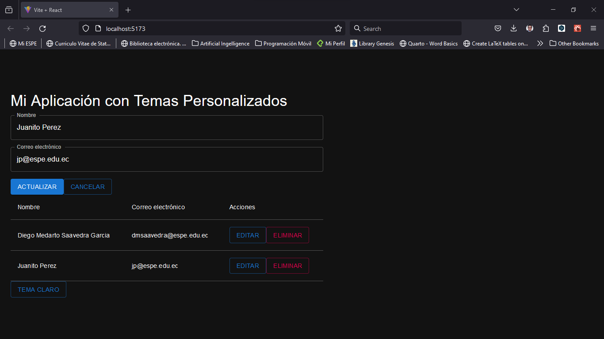
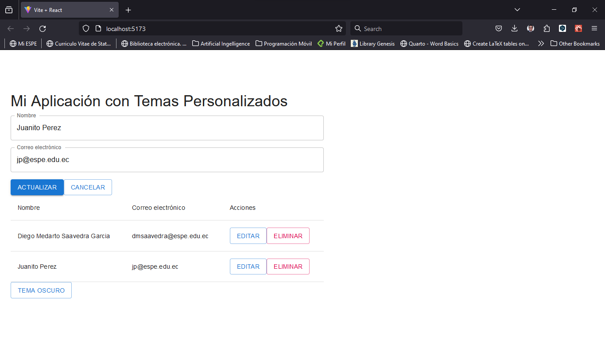

# Temas personalizados con MUI

| Tema Oscuro               | Tema Claro                 |
| ------------------------- | -------------------------- |
|  |  |

Aprende a crear temas personalizados con MUI, utilizando la función `createTheme` y el componente `ThemeProvider`.

## Paso 1: Configuración del proyecto

Primero, necesitas configurar un proyecto de React con Vite. Si aún no tienes uno configurado, puedes crear uno ejecutando el siguiente comando en tu terminal:

```bash
npm init vite@latest .
```
Luego, instala las dependencias necesarias ejecutando:

```bash
npm install @mui/material @emotion/react @emotion/styled
```
Esto instalará el paquete principal de MUI y las dependencias de Emotion, que son necesarias para el motor de estilos de MUI.

## Paso 2: Creación del tema personalizado

En el archivo de entrada de tu aplicación (generalmente **App.js**), importa las funciones necesarias de MUI:

```jsx

import { createTheme, ThemeProvider } from '@mui/material/styles';
```
Luego, crea un objeto de tema personalizado utilizando la función createTheme:

``` jsx

const theme = createTheme({
  palette: {
    mode: 'light',
    primary: {
      main: '#1976d2',
    },
    secondary: {
      main: '#dc004e',
    },
  },
});
```
Puedes personalizar los colores principales (primary) y secundarios (secondary) según tus preferencias. Este es solo un ejemplo.

## Paso 3: Aplicación del tema personalizado

Envuelve tu aplicación con el componente ThemeProvider y pasa el objeto de tema creado como prop:

``` jsx

function App() {
  const [darkMode, setDarkMode] = useState(false);
  const [formData, setFormData] = useState({ name: "", email: "" });
  const [users, setUsers] = useState([]);
  const [selectedUserId, setSelectedUserId] = useState(null);

  const toggleDarkMode = () => {
    setDarkMode(!darkMode);
  };

  const theme = createTheme({
    palette: {
      mode: darkMode ? "dark" : "light",
      primary: {
        main: "#1976d2",
      },
      secondary: {
        main: "#dc004e",
      },
    },
  });

  const handleInputChange = (e) => {
    const { name, value } = e.target;
    setFormData({ ...formData, [name]: value });
  };

  const handleSubmit = (e) => {
    e.preventDefault();
    if (selectedUserId !== null) {
      const updatedUsers = users.map((user) =>
        user.id === selectedUserId ? { ...user, ...formData } : user
      );
      setUsers(updatedUsers);
      setSelectedUserId(null);
    } else {
      const newUser = { id: Date.now(), ...formData };
      setUsers([...users, newUser]);
    }
    setFormData({ name: "", email: "" });
  };

  const handleEdit = (id) => {
    const user = users.find((user) => user.id === id);
    setFormData({ name: user.name, email: user.email });
    setSelectedUserId(id);
  };

  const handleDelete = (id) => {
    const updatedUsers = users.filter((user) => user.id !== id);
    setUsers(updatedUsers);
  };

  return (
    <ThemeProvider theme={theme}>
      <CssBaseline />
      <Container>
        <Typography variant="h4" component="h1" gutterBottom>
          Mi Aplicación con Temas Personalizados
        </Typography>
        <form onSubmit={handleSubmit}>
          <Grid container spacing={2}>
            <Grid item xs={12}>
              <TextField
                label="Nombre"
                name="name"
                fullWidth
                value={formData.name}
                onChange={handleInputChange}
              />
            </Grid>
            <Grid item xs={12}>
              <TextField
                label="Correo electrónico"
                name="email"
                fullWidth
                value={formData.email}
                onChange={handleInputChange}
              />
            </Grid>
            <Grid item xs={12}>
              <Button variant="contained" color="primary" type="submit">
                {selectedUserId !== null ? "Actualizar" : "Agregar"}
              </Button>
              {selectedUserId !== null && (
                <Button
                  onClick={() => setSelectedUserId(null)}
                  variant="outlined"
                  color="primary"
                >
                  Cancelar
                </Button>
              )}
            </Grid>
          </Grid>
        </form>
        <TableContainer>
          <Table>
            <TableHead>
              <TableRow>
                <TableCell>Nombre</TableCell>
                <TableCell>Correo electrónico</TableCell>
                <TableCell>Acciones</TableCell>
              </TableRow>
            </TableHead>
            <TableBody>
              {users.map((user) => (
                <TableRow key={user.id}>
                  <TableCell>{user.name}</TableCell>
                  <TableCell>{user.email}</TableCell>
                  <TableCell>
                    <Button
                      onClick={() => handleEdit(user.id)}
                      variant="outlined"
                      color="primary"
                    >
                      Editar
                    </Button>
                    <Button
                      onClick={() => handleDelete(user.id)}
                      variant="outlined"
                      color="secondary"
                    >
                      Eliminar
                    </Button>
                  </TableCell>
                </TableRow>
              ))}
            </TableBody>
          </Table>
        </TableContainer>
        <Button onClick={toggleDarkMode} variant="outlined" color="primary">
          {darkMode ? "Tema Claro" : "Tema Oscuro"}
        </Button>
      </Container>
    </ThemeProvider>
  );
}
```
En este ejemplo, hemos creado un tema personalizado con un modo claro y oscuro, y lo hemos aplicado a nuestra aplicación utilizando el componente ThemeProvider. También hemos agregado un botón para cambiar entre el modo claro y oscuro.

```jsx

export default App;

```
Finalmente exportamos nuestro componente App.

Con estos pasos, has creado y aplicado un tema personalizado a tu aplicación utilizando Material-UI.

¡Eso es todo! Ahora has aprendido a crear y aplicar temas personalizados con MUI en tu aplicación de React.

## Ejecutar la aplicación

Para ver tu aplicación con el tema personalizado en funcionamiento, ejecuta el siguiente comando en tu terminal:

``` bash
npm run dev
```
Esto abrirá tu aplicación en tu navegador predeterminado en la dirección [http://localhost:5173/](http://localhost:5173/).